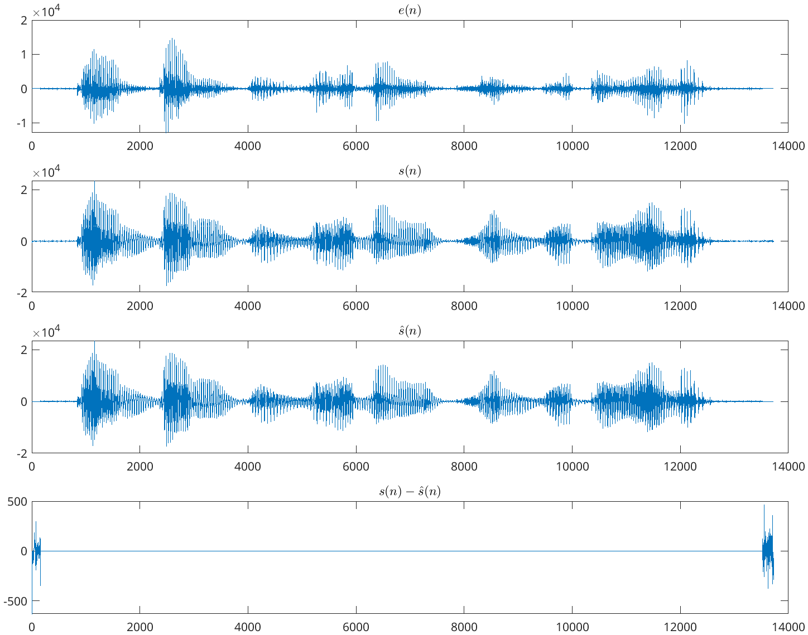
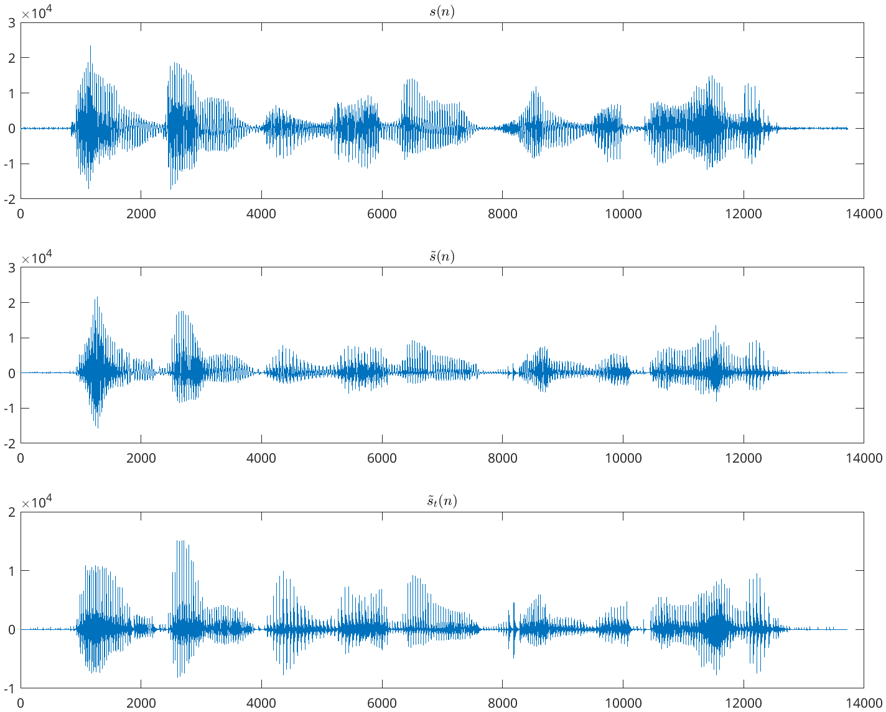

# 语音合成大作业 实验报告

## 1 语音预测模型

### (1)

**给定**

$$
e(n) = s(n) - a_1s(n-1) - a_2s(n-2)
$$

**假设 $e(n)$ 是输入信号，$s(n)$ 是输出信号，上述滤波器的传递函数是什么？如果 $a_1 = 1.3789$，$a_2 = −0.9506$，上述合成模型的共振峰频率是多少？用 `zplane`，`freqz`，`impz` 分别绘出零极点图，频率响应和单位样值响应。用 `filter` 绘出单位样值响应，比较和 `impz` 的是否相同。**

对于该式

$$
e(n) = s(n) - a_1s(n-1) - a_2s(n-2)
$$

进行 Z 变换，得到传递函数

$$
H(z) = \frac{1}{1 - a_1z^{-1} - a_2z^{-2}}
$$

如果 $a_1 = 1.3789$，$a_2 = -0.9506$，由 $\Omega = \omega T$，其中 $T$ 表示抽样间隔，$\omega$ 表示模拟频率（弧度），可知共振峰频率

$$
f = \frac{\omega}{2\pi} = \frac{\Omega f_s}{2\pi}
$$

用 MATLAB 计算可知

```matlab
fs = 8000;
b = 1;
a = [1, -1.3789, 0.9506];
[~, p, ~] = tf2zp(b, a);
f = (abs(angle(p)) * fs) / (2 * pi);
```

$$
f = 999.9447 \text{ Hz} \approx 1 \text{ kHz}
$$

用 `zplane` 画出零极点图：

```matlab
zplane(b, a);
```


用 `freqz` 画出频率响应图：

```matlab
freqz(b, a);
```


用 `impz` 画出单位样值响应图：

```matlab
impz(b, a);
```


用 `filter` 画出单位样值响应图：

```matlab
n = 0:390;
x = zeros(1, 391);
x(1) = 1;
y = filter(b, a, x);
stem(n, y);
xlim([0, 390]);
xlabel('n (采样)');
ylabel('振幅');
title('Impulse 响应');
```


可以看到 `impz` 和 `filter` 的结果是一致的。

### (2)

**阅读 `speechproc.m` 程序，理解基本流程。程序中已经完成了语音分帧、加窗、线性预测、和基音周期提取等功能。注意：不要求掌握线性预测和基音周期提取的算法原理。**

`speechproc.m` 程序的基本流程为：

处理每一帧语音时，首先计算预测系数，然后计算激励，最后生成合成激励，产生合成语音。

### (3)

**运行该程序到 27 帧时停住，用 (1) 中的方法观察零极点图。**

写如下代码

```matlab
zplane(1, A);
```

得


### (4)

**在循环中添加程序：对每帧语音信号 $s(n)$ 和预测模型系数 $\{a_i\}$，用 `filter` 计算激励信号 $e(n)$。注意：在系数变化的情况下连续滤波，需维持滤波器的状态不变，要利用 `filter` 的 `zi` 和 `zf` 参数。**

若要维持滤波器的状态不变，需要使新的滤波器的初始条件与上一个滤波器的最终条件相同，即 `zi` 为上一个滤波器的 `zf`。

```matlab
[exc((n-1)*FL+1:n*FL), zi_pre] = filter(A, 1, s_f, zi_pre);
```

### (5)

**完善 `speechproc.m` 程序，在循环中添加程序：用你计算得到的激励信号 $e(n)$ 和预测模型系数 $\{a_i\}$，用 `filter` 计算重建语音 $\hat{s}(n)$。同样要注意维持滤波器的状态不变。**

同样要注意维持滤波器的状态不变，故而需要使新的滤波器的初始条件与上一个滤波器的最终条件相同，即 `zi` 为上一个滤波器的 `zf`。

```matlab
[s_r((n-1)*FL+1:n*FL), zi] = filter(1, A, exc((n-1)*FL+1:n*FL), zi);
```

### (6)

**在循环结束后添加程序：用 `sound` 试听 (6) 中的 $e(n)$ 信号，比较和 $s(n)$ 以及 $\hat{s}(n)$ 信号有何区别。对比画出三个信号，选择一小段，看看有何区别。**

```matlab
sound([s;exc;s_rec] / 32768, 8000);
```

试听发现，$e(n)$ 信号和 $s(n)$ 信号有很大的区别：前者非常模糊，很难听清楚，而后者可以很清楚地听到“电灯比油灯进步多了”；相比之下 $\hat{s}(n)$ 信号和 $s(n)$ 信号的区别较小。

下面画出三个信号的波形图：

```matlab
figure;
subplot(4, 1, 1);
plot(exc);
title('$e(n)$', 'Interpreter', 'latex');
subplot(4, 1, 2);
plot(s);
title('$s(n)$', 'Interpreter', 'latex');
subplot(4, 1, 3);
plot(s_rec);
title('$\hat{s}(n)$', 'Interpreter', 'latex');
subplot(4, 1, 4);
delta = s - s_rec;
plot(delta);
title('$s(n)-\hat{s}(n)$', 'Interpreter', 'latex');
```



由图像可见，激励 $e(n)$ 与 $s(n)$ 在波形上有很大的区别，而重建语音 $\hat{s}(n)$ 与 $s(n)$ 的区别较小，仅在两端存在一些相对较大的差别。

取出一小段进行比较：

```matlab
figure;
subplot(4, 1, 1);
exc_clip = exc(2000 : 3000);
plot(exc_clip);
title('$e(n)$', 'Interpreter', 'latex');
subplot(4, 1, 2);
s_clip = s(2000 : 3000);
plot(s_clip);
title('$s(n)$', 'Interpreter', 'latex');
subplot(4, 1, 3);
s_rec_clip = s_rec(2000 : 3000);
plot(s_rec_clip);
title('$\hat{s}(n)$', 'Interpreter', 'latex');
subplot(4, 1, 4);
delta_clip = s_clip - s_rec_clip;
plot(delta_clip);
title('$s(n)-\hat{s}(n)$', 'Interpreter', 'latex');
```


可见，在中间的语音部分，$\hat{s}(n)$ 与 $s(n)$ 的差异非常小，几乎可以忽略不计。

## 2 语音合成模型

### (7)

**生成一个 8 kHz 抽样的持续 1 秒钟的数字信号，该信号是一个频率为 200 Hz 的单位样值“串”，即**

$$
x(n) = \sum_{i=0}^{NS-1} \delta(n-iN)
$$

**考虑该信号的 $N$ 和 $NS$ 分别为何值？用 `sound` 试听这个声音信号。再生成一个 300 Hz 的单位样值“串”并试听，有何区别？事实上，这个信号将是后面要用到的以基音为周期的人工激励信号 $e(n)$。**

```matlab
fs = 8000;
```

对于 200 Hz 的单位样值“串”，$N$ 可以取 $N = \frac{f_s}{f} = 40$，$NS$ 可以取 $NS = f_s = 8000$。

```matlab
f_200 = 200;
N_200 = floor(fs / f_200);
NS_200 = fs;
x_200 = zeros(1, NS_200);
for i = 0:NS_200-1
    if mod(i, N_200) == 0
        x_200(i+1) = 1;
    end
end

sound(x_200, fs);
```

对于 300 Hz 的单位样值“串”，$N$ 可以取 $N = \frac{f_s}{f} = 26$，$NS$ 可以取 $NS = f_s = 8000$。

```matlab
f_300 = 300;
N_300 = floor(fs / f_300);
NS_300 = fs;
x_300 = zeros(1, NS_300);
for i = 0:NS_300-1
    if mod(i, N_300) == 0
        x_300(i+1) = 1;
    end
end

sound(x_300, fs);
```

可以听出来，200 Hz 的单位样值“串”音调比 300 Hz 的单位样值“串”音调低一些。

### (8)

**真实语音信号的基音周期总是随着时间变化的。我们首先将信号分成若干个 10 毫秒长的段，假设每个段内基音周期固定不变，但段和段之间则不同，具体为**

$$
PT = 80 + 5 \text{mod}(m, 50)
$$

**其中 $PT$ 表示基音周期，$m$ 表示段序号。生成 1 秒钟的上述信号并试听。（提示：用循环逐段实现，控制相邻两个脉冲的间隔为其中某个脉冲所在段的 $PT$ 值。）**

```matlab
PT = zeros(1, 100);
for m = 1:100
    PT(m) = 80 + 5 * mod(m-1, 50);
end

fs = 8000;
x = zeros(1, fs);
n = 1;
while n <= fs
    x(n) = 1;
    n = n + PT(ceil(n/80));
end

sound(x, fs);
```

听起来有连续两声气泡声。可以通过图像看到：


### (9)

**用 `filter` 将 (8) 中的激励信号 $e(n)$ 输入到 (1) 的系统中计算输出 $s(n)$，试听和 $e(n)$ 有何区别。**

```matlab
b = 1;
a = [1, -1.3789, 0.9506];
s = filter(b, a, x);
sound(s, fs);
```

可以听到，音调似乎变高了，而且声音更加清晰。可以通过图像看到：


这相当于给激励信号 $e(n)$ 加了一些包络，频率也更加集中在 1000 Hz 附近，这正是 (1) 中的系统的共振峰频率。

### (10)

**重改 `speechproc.m` 程序。利用每一帧已经计算得到的基音周期和 (8) 的方法，生成合成激励信号 $Gx(n)$（$G$ 是增益），用 `filter` 函数将 $Gx(n)$ 送入合成滤波器得到合成语音 $\tilde{s}(n)$。试听和原始语音有何差别。**

考虑到最好保持滤波器状态不变，我在合成滤波器部分添加了 `zi_syn`。

```matlab
zi_syn = zeros(P,1);
```

在循环外添加一个迭代变量 `i`

```matlab
i = 2 * FL + 1;
```

在循环中添加

```matlab
while i <= n * FL
    exc_syn(i) = G;
    i = i + PT;
end
[s_syn((n-1)*FL+1:n*FL), zi_syn] = filter(1, A, exc_syn((n-1)*FL+1:n*FL), zi_syn);
```

由图像可以看出，合成语音 $\tilde{s}(n)$ 与原始语音 $s(n)$ 的区别较大，听起来更加有颗粒感。


## 3 变速不变调

### (11)

**仿照 (10) 重改 `speechproc.m` 程序，只不过将 (10) 中合成激励的长度增加一倍，即原来 10 毫秒的一帧变成了 20 毫秒一帧，再用同样的方法合成出语音来，如果你用原始抽样速度进行播放，就会听到慢了一倍的语音，但是音调基本没有变化。**

类似于 (10)，我在合成激励信号部分添加了 `zi_syn_v`。

```matlab
zi_syn_v = zeros(P, 1);
```

在循环外添加一个迭代变量 `i_v`

```matlab
i_v = 4 * FL + 1;
```

在循环中添加

```matlab
while i_v <= n * 2 * FL
    exc_syn_v(i_v) = G;
    i_v = i_v + PT;
end
[s_syn_v((n-1)*2*FL+1:n*2*FL), zi_syn_v] = filter(1, A, exc_syn_v((n-1)*2*FL+1:n*2*FL), zi_syn_v);
```

由图像可以看出，合成语音 $\tilde{s}_v(n)$ 与 $\tilde{s}(n)$ 相比，疏密程度没有变化，但是速度变慢了一倍。体现在频域上，频域形状变化不大。实现了变速不变调滤波器。


## 4 变调不变速

### (12)

**重新考察 (1) 中的系统，将其共振峰频率提高 150 Hz 后的 $a_1$ 和 $a_2$ 分别是多少？**

由 (1) 可知，

$$
f = \frac{\Omega f_s}{2\pi}
$$

故而若 $f$ 要提高 150 Hz，则 $\Omega$ 要提高 $\frac{300\pi}{f_s}$。

```matlab
b = 1;
a = [1, -1.3789, 0.9506];
[z, p, k] = tf2zp(b, a);

p = p .* exp(1j * sign(angle(p)) * 300 * pi / 2);

[b1, a1] = zp2tf(z, p, k);
```

得到 $a_1 = -1.2073$，$a_2 = 0.9506$，检验得此时 $f = 1149.94 Hz \approx 1.15 kHz$。

### (13)

**仿照 (10) 重改 `speechproc.m` 程序，但要将基音周期减小一半，将所有的共振峰频率都增加 150 Hz，重新合成语音，听听是何感受。**

类似于 (10)，我在合成激励信号部分添加了 `zi_syn_t`。

```matlab
zi_syn_t = zeros(P, 1);
```

在循环外添加一个迭代变量 `i_t`

```matlab
i_t = 2 * FL + 1;
```

在循环中添加

```matlab
[z, p, k] = tf2zp(1, A);
p = p .* exp(1j * sign(angle(p)) * 300 * pi / 8000);
[B_t, A_t] = zp2tf(z, p, k);
while i_t <= n * FL
    exc_syn_t(i_t) = G;
    i_t = i_t + PT;
end
[s_syn_t((n-1)*FL+1:n*FL), zi_syn_t] = filter(B_t, A_t, exc_syn_t((n-1)*FL+1:n*FL), zi_syn_t);
```

可以听到，合成语音 $\tilde{s}_t(n)$ 与 $\tilde{s}(n)$ 相比，音调变高了，但是速度没有变化。同时，频域变化很大，高频音调更突出。实现了变调不变速滤波器。




